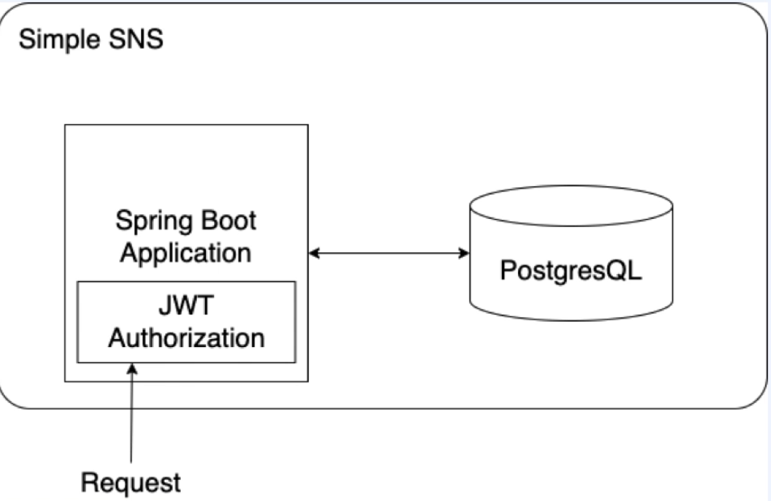

# simple-sns

## 기능
### 게시글 페이지
1. 초기 기준 목록
2. 첫 페이지에 몇 개의 글?
3. 페이징 처리
4. 제목과 본문을 작성
### 회원가입
1. username과 password로 가입
2. username과 password로 로그인
3. 프로필 페이지에서 제목,작성자,본문의 정보 필요
4. 수정 버튼과 삭제 버튼

## API 설계
### Feed Page
1. 모든 user의 글을 모아서 보여주는 API
2. Paging 및 정렬 필요
3. 제목, 작성자, 본문
### Write Post Page
- 제목과 본문을 이용해 포스트 작성
### Sign Up Page
- username과 password를 이용해 회원가입
### Sign in page
- username과 password를 받아 로그인
### My Post Page
1. 로그인한 user의 글을 모아서 보여주는 API
2. Paging 및 정렬 필요
3. 제목, 작성자, 본문
4. Post Delete API
5. Post Modify API

## DB 선택
1. 대용량 데이터를 위한 db
- HBASE
- cassandra
2. 관계형 데이터에 용이한 db
- PostgreSQL
- MySQL
데이터 관계가 복잡할 경우 다수의 JOIN이 발생하여 성능에 영향을 줄 수 있다. 수평 확장에 불리하다
3. 데이터 분석에 용이한 db
- druid
4. 비관계형 데이터에 용이한 db
- redis
- mongoDB
- CouchDB
질의하기가 어렵다. 다수의 업데이트가 일어나는 경우 성능측면에서 불리하다.

이번 프로젝트에서는 회원정보와 게시글의 데이터를 저장해야 하고 관계가 명확하기 때문에 RDBMS 중 PostgreSQL을 사용

## 인증과 인가
JWT Authorization 이용

## 사용 기술 스택
- Java 11
- Spring Boot 2.6.7
- Spring JPA
- Spring Security
- Gradle
- Lombok
- Github
- Junit5
- Kafka
- Postgresql
- Redis
- Heroku
- SSE
